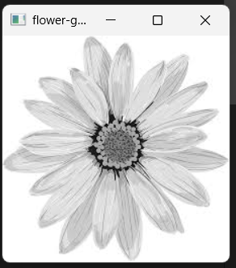
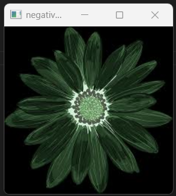
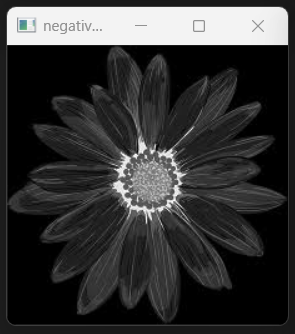

# Image Processing Experiment: Image Simulation and Negative Transformation

## Overview
This project demonstrates the simulation and display of an image, along with generating its negative in both **binary** and **grayscale** formats using OpenCV.

## Features
- Load and display an image in **color** and **grayscale**.
- Compute the **negative** of an image in both color and grayscale.
- Display the results using OpenCV.

## Requirements
Make sure you have the following installed before running the code:
- Python (3.x recommended)
- OpenCV (`cv2` module)

### Installation
To install OpenCV, run the following command:
```bash
pip install opencv-python
```

## How It Works
1. **Load Image**: The image is loaded using `cv2.imread()` in both **color** and **grayscale** modes.
2. **Display Image**: The original image is displayed using `cv2.imshow()`.
3. **Negative Transformation**:
   - Color Negative: `negative_flower = 255 - flower`
   - Grayscale Negative: `negative_gray_flower = 255 - grayFlower`
4. **Display Results**: The negative images are displayed in separate windows.
5. **Wait for Key Press**: The program waits for user input before closing.

## Sample Images
### **Original Image**


### **Grayscale Image**


### **Negative of Color Image**


### **Negative of Grayscale Image**


## Usage
To run the script, execute the following command:
```bash
python expe1.py
```
Make sure the image (`flower.jpg`) is present in the `images/` directory.

## License
This project is open-source and free to use. Feel free to modify and contribute!

---
